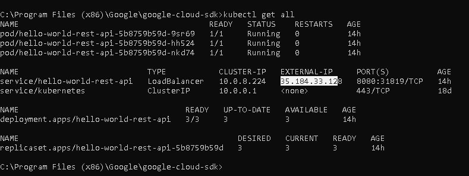
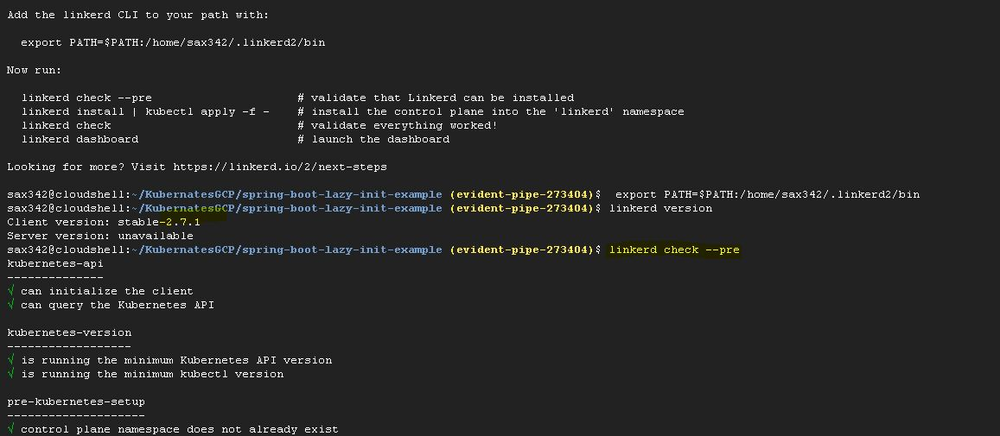
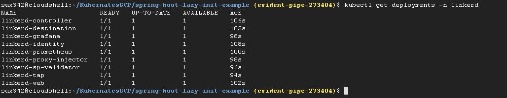
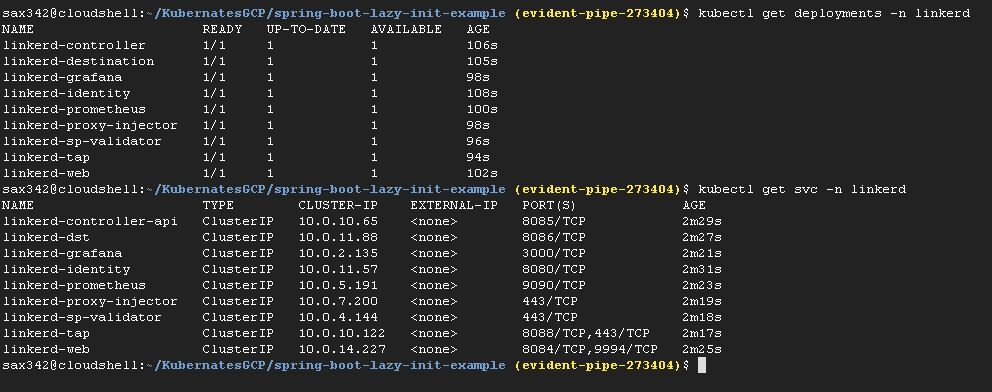
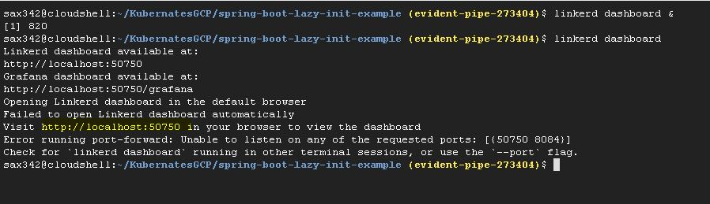
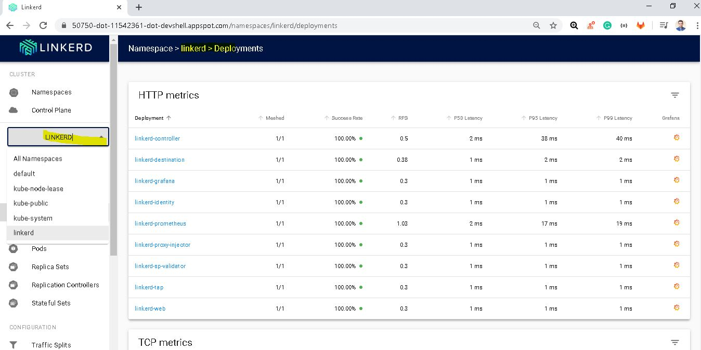
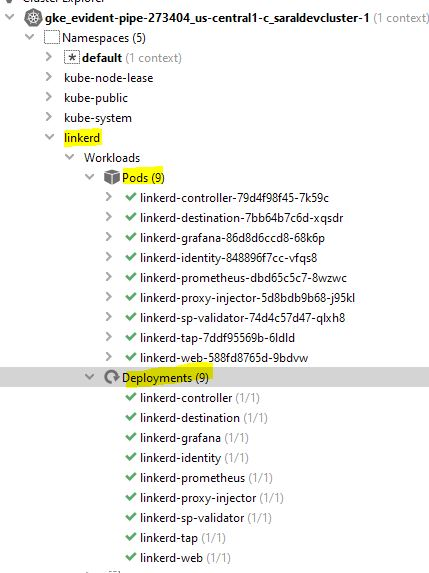
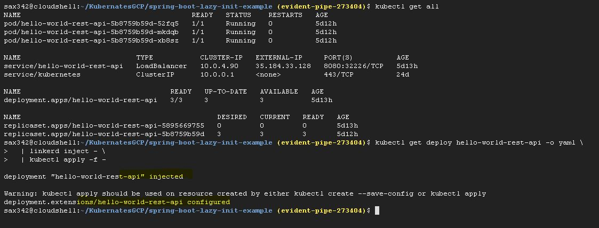
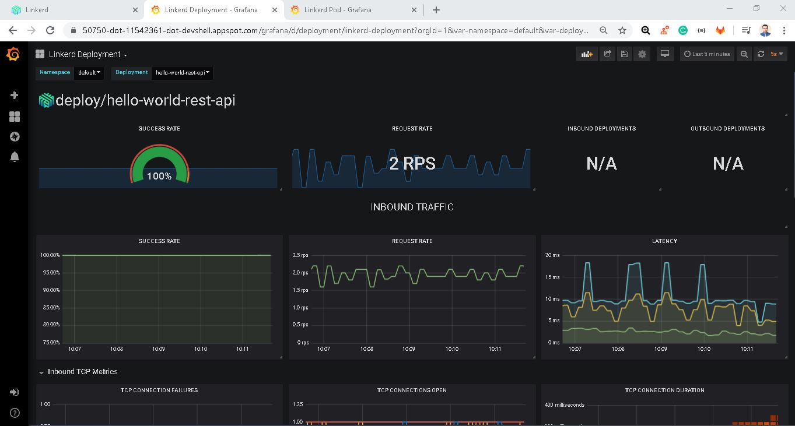
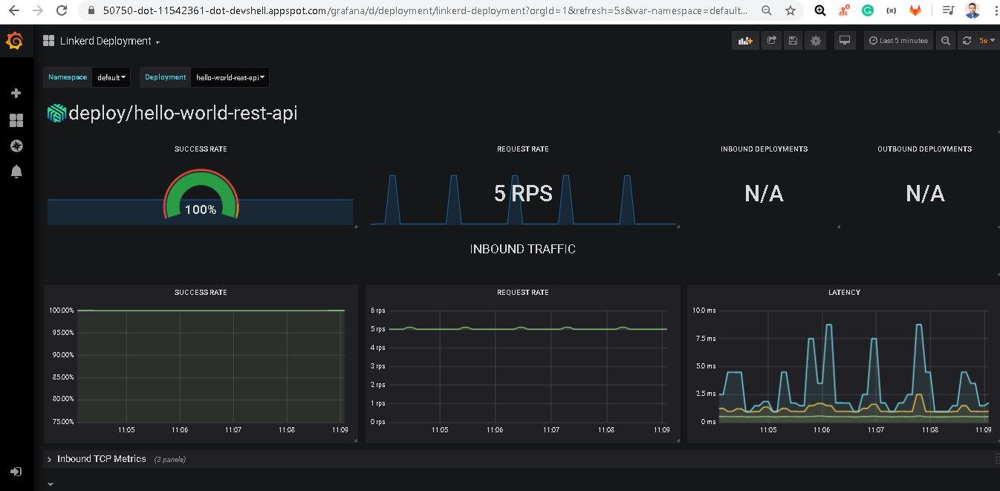

# Hello World Rest API

### Running the Application

- http://localhost:8080/hello-world

```txt
Hello World V1 abcde
```

- http://localhost:8080/hello-world-bean

```json
{"message":"Hello World"}
```

- http://localhost:8080/hello-world/path-variable/saral

```json
{"message":"Hello World, Saral"}
```

- Docker Image url
https://hub.docker.com/repository/docker/sarals/hello-world-rest-api/tags?page=1

- Kubernates services snapshot 
https://github.com/SaralSaxena/Kubernates-Docker-GCP/blob/master/


- Installing linkerd service mesh on K8s cluster 
https://github.com/SaralSaxena/Kubernates-Docker-GCP/blob/master/LinkCapture2.JPG


- checking nodes after installing linkerd 
https://github.com/SaralSaxena/Kubernates-Docker-GCP/blob/master/LinkCapture3.JPG


- checking deployments and services after installing linkerd 
https://github.com/SaralSaxena/Kubernates-Docker-GCP/blob/master/LinkCapture4.JPG


- starting linkerd dashboard
https://github.com/SaralSaxena/Kubernates-Docker-GCP/blob/master/LinkCapture6.JPG


- finally the view of linkerd dashboard
https://github.com/SaralSaxena/Kubernates-Docker-GCP/blob/master/LinkCapture8.JPG


- linkerd YAML on K8s cluster
https://github.com/SaralSaxena/Kubernates-Docker-GCP/blob/master/LinkCapture10.JPG


- finally command to bind (inject the linkerd services) with our spring boot project
https://github.com/SaralSaxena/Kubernates-Docker-GCP/blob/master/LinkCapture11.JPG


- finally grafana dashboard hat is given by linkerd is being used to extract metrics with our spring boot project
https://github.com/SaralSaxena/Kubernates-Docker-GCP/blob/master/LinkCapture12.JPG


- finally grafana dashboard hat is given by linkerd is being used to extract metrics with our spring boot project
https://github.com/SaralSaxena/Kubernates-Docker-GCP/blob/master/LinkCapture13.JPG


